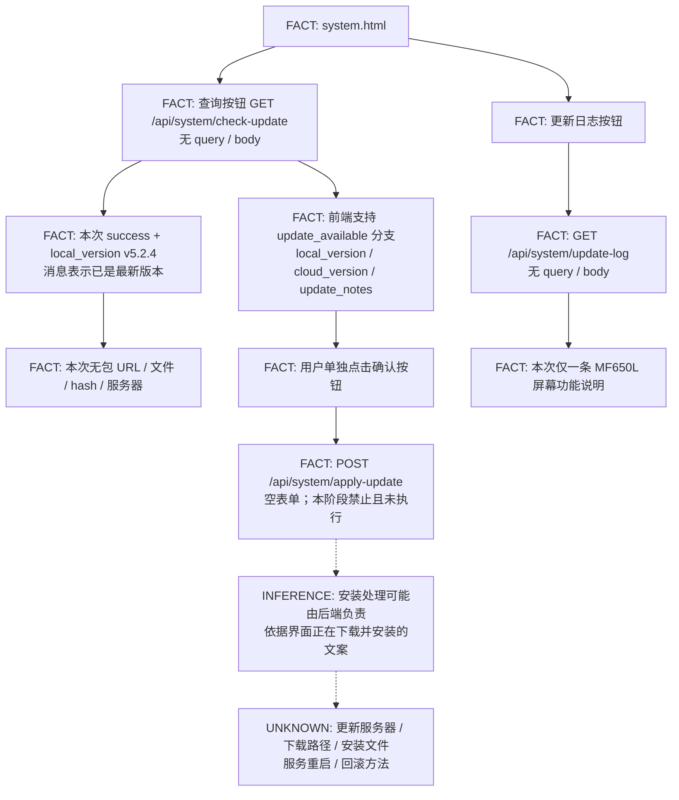

# 8081 更新流程与请求合同

2026-10-02。当前在线版本标签 **v5.2.4**；本阶段结果 **CASE C / METADATA_ONLY_BACKEND_ARTIFACT_MISSING**。更新页面已重新取得，未调用安装接口。

## 证据定位

来源：`http://192.168.100.1:8081/html/system.html`，2026-10-02 19:23:00.843331 +08:00，HTTP 200，90,819 bytes。原文保存在本地忽略目录 `test-results/update-channel/system-page/body.bin`。

SHA256：`8b3721397ad8682f2483fef7129097e54b5fb59c969442fa753516892c3ae204`。与上一阶段 `analysis/web8081/html/html-system.html` 完全相同。下文行号按 UTF-8 原文、一基行号计算。

**FACT** 表示源码或已保存响应直接证明；**INFERENCE** 表示由界面/调用关系推断；**UNKNOWN** 表示尚无后端文件或运行证据。

## 流程图

`update_available` 是源码中的条件分支，本次未观察到。虚线表示后端行为推断，不能作为已执行或已验证的事实。

## HTTP 包装函数

| 定位 | 行为 | 结论 |
| --- | --- | --- |
| `getApi`，1555–1562 | `fetch(endpoint, {cache: 'no-store'})`，没有 method/body | Fetch 默认 GET；原样使用相对 API 路径，不拼接外部 base URL |
| `postApi`，1539–1553 | 创建 URLSearchParams；存在 params 才逐项加入；显式 method POST | Content-Type 为 `application/x-www-form-urlencoded`，body 为序列化表单 |
| 两个包装函数 | 403 抛 DEVICE_LOCKED，非成功 HTTP 抛错误，成功解析 JSON | 没有在这些函数中添加认证参数、下载 URL 或请求重试 |

## 三个更新接口

| 接口 | 完整 URL | 方法与参数 | 响应字段与作用 | 是否执行 |
| --- | --- | --- | --- | --- |
| check-update | `http://192.168.100.1:8081/api/system/check-update` | GET；无 query；无 body；1837 行 | `status`、`message`；有更新时读取 `local_version`、`cloud_version`、`update_notes` | 一次 |
| update-log | `http://192.168.100.1:8081/api/system/update-log` | GET；无 query；无 body；2266 行 | `status`、`log_content`、失败时 `message` | 一次 |
| apply-update | `http://192.168.100.1:8081/api/system/apply-update` | POST；无 query；1874 行没有第二个 params 参数，因此 body 为**空字符串** | `status`、成功时可选 `version`、失败时 `message` | **NOT EXECUTED** |

没有证据表明 apply-update 接收文件上传、下载地址、版本选择或 hash 参数。后端是否接受其他未公开参数 UNKNOWN。

## check-update 完整分支

1832–1865 行的点击回调先重置并显示弹窗，再发 GET。收到 JSON 后：

1. `status === 'success'`：显示已是最新版；该分支不要求 cloud_version，也不显示其值。
2. `status === 'update_available'`：显示 local_version、cloud_version，出现单独的确认/取消按钮；非空 update_notes 以文字展示。
3. 其他 status：展示 message 或检测失败。
4. HTTP/解析异常：展示检测失败及 error.message；403 由 getApi 抛出 DEVICE_LOCKED。

这些分支只改变 DOM。**没有调用下载接口、apply-update、install、upgrade、restart 或 reboot，也没有 action/query/body 指令。** 单凭这份前端无法证明后台检查版本时从何取数、是否写日志/缓存。

## apply-update 静态恢复

1868–1892 行为独立确认按钮回调。1871 行显示“正在下载并安装更新”的提示，1874 行调用 `postApi('/api/system/apply-update')`。成功后显示可选 data.version 并调用 loadSystemInfo；失败/异常显示错误。取消/关闭回调只隐藏弹窗。

**INFERENCE：**下载、解包、安装若存在，应在后端处理或后端调用链中实现，前端没有提供可在 PC 复用的包 URL。**UNKNOWN：**实际服务器、存储路径、安装脚本、service/unit、重启与回滚行为。界面文案不能证明具体安装机制。

## update-log 与初始化

2238 行打开日志弹窗并调用 fetchUpdateLog；2263–2275 行发 GET，成功显示 data.log_content，失败显示 message/错误。本次日志内容为“新增自研大屏幕（MF650L屏幕）”，无版本、日期、构建号、包名、开发者或地址。

2278 行之后的初始化调用系统信息及 LCD 状态轮询，没有自动调用 check-update 或 apply-update。本阶段使用 HTTP 客户端保存页面，未运行浏览器 JS，因此没有触发这些页面轮询。

## 下载地址追踪结论

对更新完整调用链及本页的外部地址/更新关键词作针对性检查：无前端拼接包 URL、固定更新 base URL、manifest URL、版本服务器 hostname 或用于下载的二次 API 请求。本页非更新用途的 QQ 群链接不是更新服务器，未加入或联系。

本次两个 JSON 的完整字段分别为 `{status, message, local_version}`、`{status, log_content}`。所有目标下载/服务器/hash 字段均未出现；不据此声称其他状态下也永远不会返回。`当前已是最新版本` 只能证明响应消息，不能证明远端检查成功或所有可用版本均不高于 v5.2.4。

脱敏定位：[UPDATE_SOURCE_MAP.json](../analysis/update-channel/reports/UPDATE_SOURCE_MAP.json)、[UPDATE_FIELD_PRESENCE.csv](../analysis/update-channel/reports/UPDATE_FIELD_PRESENCE.csv)。请求与取证见 [8081_UPDATE_CHANNEL_AUDIT.md](8081_UPDATE_CHANNEL_AUDIT.md)，后端缺口见 [8081_BACKEND_ARTIFACT_REPORT.md](8081_BACKEND_ARTIFACT_REPORT.md)。
