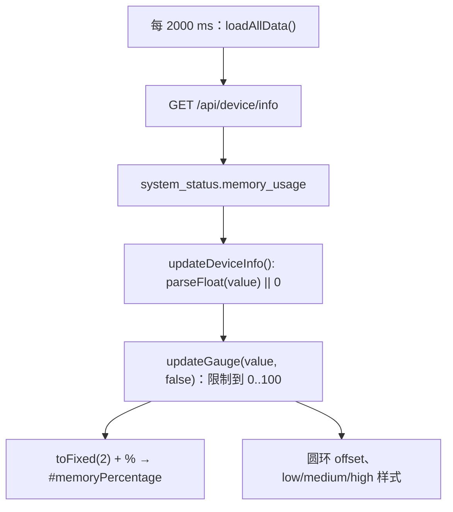

# MF650 8081 RAM 显示链路

2026-10-02。只分析，未修改或部署页面/后台。证据来自当前 `/mf650.html`、`/html/mf650.html` 和实际匿名 GET JSON；两个首页别名的 body SHA256 均为 `bc4a01ccbb817ee801c7a16c32e18385b9aa0dc34e75e8f53182c6361b2fbbc8`。

## FACT：API → JS → UI



原 HTML 行号：2000 ms 刷新设置在 565–579；`updateGauge` 在 726–744；`updateDeviceInfo` 在 747–787，RAM 调用在 **761**；`loadAllData` 在 816–825，API 在 **818**。

前端只显示后台百分比，没有 `total-free` 或 `total-available` 计算，没有读取 `/proc/meminfo`，也没有通过其他 RAM API 合并 MemAvailable。

当前 `/api/device/info` 的实际 JSON 节选：

```json
{
  "success": true,
  "system_status": {
    "cpu_usage": 98.03,
    "memory_usage": 89.97,
    "cpu_temperature": "36.7",
    "wifi_temperature": "35.0",
    "sdx_temperature": "35.1"
  }
}
```

这是一次真实采样的非敏感节选，不是完整 JSON 或持续负载结论。完整响应及时间/hash 留在 `test-results/web8081/api-device-info.json` 和 api-requests.json；公开请求元数据见 [manifest](../analysis/web8081/reports/HTTP_GET_MANIFEST.csv)。此时首页按现有 JS 显示 **89.97%**；没有可计算的新 RAM 百分比。

## FACT：缺失字段与其他状态接口

| 数据 | 本轮结果 |
| --- | --- |
| `system_status.memory_usage` | 存在，float，89.97 |
| MemTotal / MemFree / MemAvailable | 在本轮 19 个 JSON 响应中均未发现 |
| raw total/free/available、Buffers/Cached/SwapTotal/SwapFree | 没有原始内存数量字段 |
| `/api/system/info` | 高级后台版本、SIM、屏幕、激活和功能开关；没有 RAM |
| `/api/device/status`、`/api/device-status` | 充电、电池和功能状态；没有原始 RAM |
| `/api/status` | 当前源码没有引用，未猜测访问 |

`_debug` 对象是设备信息解析诊断，含 showall_bytes/parsed_count 等；不是内存原文或 shell 执行入口。不能把名为 bytes 的调试计数当成 MemTotal。

## FACT：RAM 圆环还有写操作

`#memoryGauge` 的 onclick 是 `clearCache()`（395–403 行），该函数在 831 行发送 **POST `/api/device/clear_cache`**，并把提示改为清理中/已清理。它不参与 RAM 统计公式，也不是纯详情按钮。本轮没有点击或请求此接口；清缓存不能替代获取 MemAvailable。

缺失/非数字百分比经 `parseFloat(...) || 0` 会显示 0%，异常值还会被 clamp；这是当前前端的可确认行为，不能据此判断真实内存压力。

## INFERENCE / UNKNOWN：后台计算来源

既有 [current_ram_display_flow.md](current_ram_display_flow.md) 的旧阶段样本支持 `Total-Free` 口径；本轮前端源码与此前相同。但没有取得当前 8081 后端源码/程序 hash 或原始 meminfo，**当前后台是否仍按 Total-Free 计算为待验证推断**，不能把历史 89.35% 当作本轮数值。

目标计算仍为 `used = MemTotal - MemAvailable`、`usage = used / MemTotal * 100`。当前 API 只有百分比，既不能反推出 total/free，也不能凭 CPU/RAM 百分比、温度或缓存猜 MemAvailable。对“89.97% 是否真实压力”保持 UNKNOWN。

下一步准备及回滚要求见 [RAM_FIX_PLAN.md](RAM_FIX_PLAN.md)。RAM 接口已存在，但**科学 RAM 口径的数据条件尚未满足**，本轮没有修复部署。
